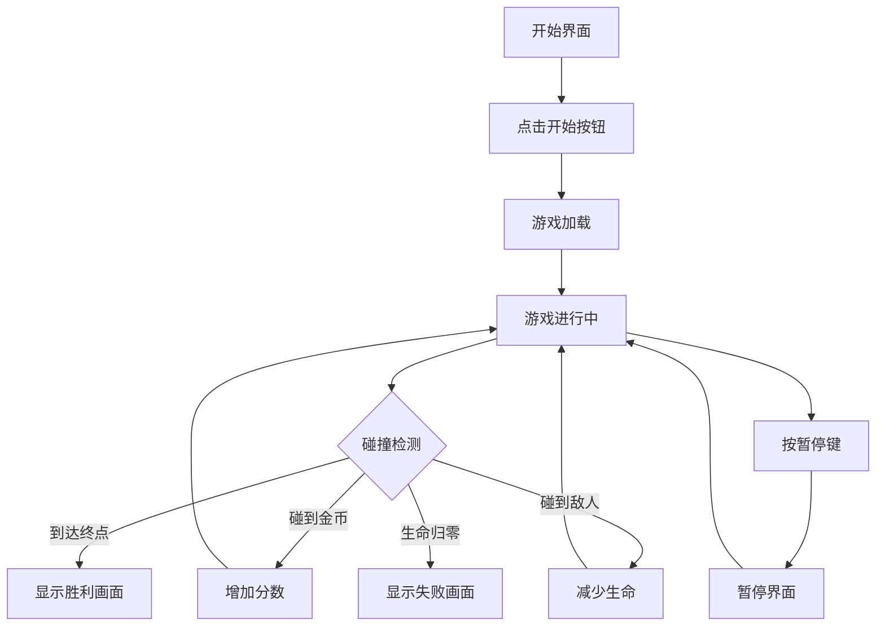

# 超级马里奥游戏 - 产品需求文档

## 1. 产品概述
一款经典风格的简易版超级马里奥网页游戏，让玩家体验平台跳跃的乐趣。
- 玩家扮演马里奥，在像素风格的世界中奔跑、跳跃，收集金币
- 躲避障碍物和敌人，目标是到达终点旗杆
- 目标用户：休闲游戏玩家，怀旧游戏爱好者

## 2. 核心功能

### 2.1 游戏角色
- **马里奥**：玩家控制的角色，可以左右移动和跳跃
- **敌人**：可移动的障碍物（蘑菇怪），碰到会失去生命
- **金币**：可收集的奖励物品，增加分数
- **障碍物**：不可摧毁的砖块和管道

### 2.2 游戏场景
- **地面**：平台游戏的基底，马里奥可以在上面行走
- **砖块**：可以被顶撞的方块，可能藏有金币
- **管道**：装饰性障碍物
- **终点旗杆**：到达后游戏胜利

### 2.3 游戏机制
1. **移动控制**：左右方向键控制移动方向
2. **跳跃**：空格键或上方向键触发跳跃
3. **碰撞检测**：与敌人、金币、地面、砖块的交互
4. **分数系统**：收集金币增加分数
5. **生命系统**：3条生命，碰到敌人减少一条
6. **游戏状态**：开始界面、游戏进行中、游戏结束/胜利

## 3. 核心流程

## 4. 用户界面设计

### 4.1 视觉风格
- **美术风格**：复古像素风格，致敬经典FC版超级马里奥
- **配色方案**：
  - 主色：#E52521（马里奥红色）
  - 辅助色：#049CD8（天空蓝）
  - 地面色：#5C2F0D（棕色土地）
  - 金币色：#FFD700（明黄色）
- **字体**：像素风格等宽字体
- **布局**：全屏游戏画布，顶部显示分数和生命

### 4.2 界面元素
| 界面 | 模块名称 | UI元素描述 |
|------|---------|-----------|
| 开始界面 | 标题区 | 大号像素字体显示"SUPER MARIO" |
| 开始界面 | 按钮区 | "开始游戏"像素风格按钮，hover时有发光效果 |
| 游戏界面 | HUD区 | 左上角显示金币数量和分数，右上角显示生命数 |
| 游戏界面 | 游戏画布 | 16:9比例的主游戏区域 |
| 游戏界面 | 控制提示 | 底部显示操作说明 |
| 结束界面 | 结果区 | 显示最终分数和重新开始按钮 |

### 4.3 动画效果
- 马里奥移动：流畅的左右奔跑动画
- 跳跃：自然的抛物线运动
- 金币收集：旋转闪烁动画 + 分数弹出
- 敌人移动：简单的左右巡逻动画

### 4.4 响应式设计
- 桌面优先设计
- 适配不同屏幕尺寸，保持16:9游戏比例
- 移动端显示虚拟按键

## 5. 技术规格

### 5.1 游戏参数
- 画布尺寸：800x600像素
- 帧率：60 FPS
- 重力加速度：0.5 px/frame²
- 跳跃力度：-12 px/frame
- 移动速度：5 px/frame

### 5.2 关卡设计
- 单关卡设计，横向卷轴
- 关卡长度：约2400像素
- 敌人数量：3-5个
- 金币数量：10-15个
