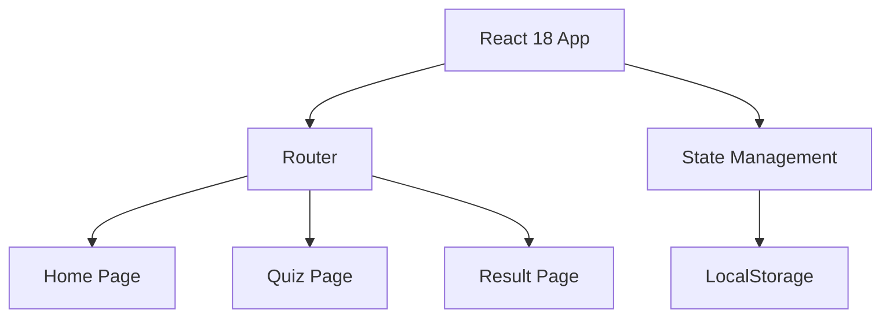

## 1. Architecture Design
前端单页应用，无后端依赖，数据存储在 localStorage



## 2. Technology Description
- Frontend: React@18 + TypeScript + tailwindcss@3 + vite + react-router-dom + zustand
- Initialization Tool: vite-init (react-ts template)
- Backend: None
- Database: LocalStorage

## 3. Route Definitions
| Route | Purpose |
|-------|---------|
| / | 首页 |
| /quiz | 测试页 |
| /result | 结果页 |

## 4. Data Types

```typescript
interface Question {
  id: number;
  text: string;
  options: Option[];
}

interface Option {
  id: string;
  text: string;
  house: House;
}

type House = 'gryffindor' | 'slytherin' | 'ravenclaw' | 'hufflepuff';

interface HouseData {
  name: string;
  colors: string[];
  description: string;
  characters: string[];
  emoji: string;
}

interface QuizState {
  answers: Record&lt;number, House&gt;;
  currentQuestion: number;
}
```

## 5. File Structure
```
/workspace
├── src/
│   ├── components/
│   │   ├── SortingHat.tsx
│   │   ├── QuestionCard.tsx
│   │   ├── ProgressBar.tsx
│   │   └── ResultCard.tsx
│   ├── pages/
│   │   ├── Home.tsx
│   │   ├── Quiz.tsx
│   │   └── Result.tsx
│   ├── hooks/
│   │   └── useQuizStore.ts
│   ├── utils/
│   │   ├── questions.ts
│   │   └── houses.ts
│   ├── App.tsx
│   ├── main.tsx
│   └── index.css
├── package.json
├── tsconfig.json
├── vite.config.ts
└── tailwind.config.js
```
