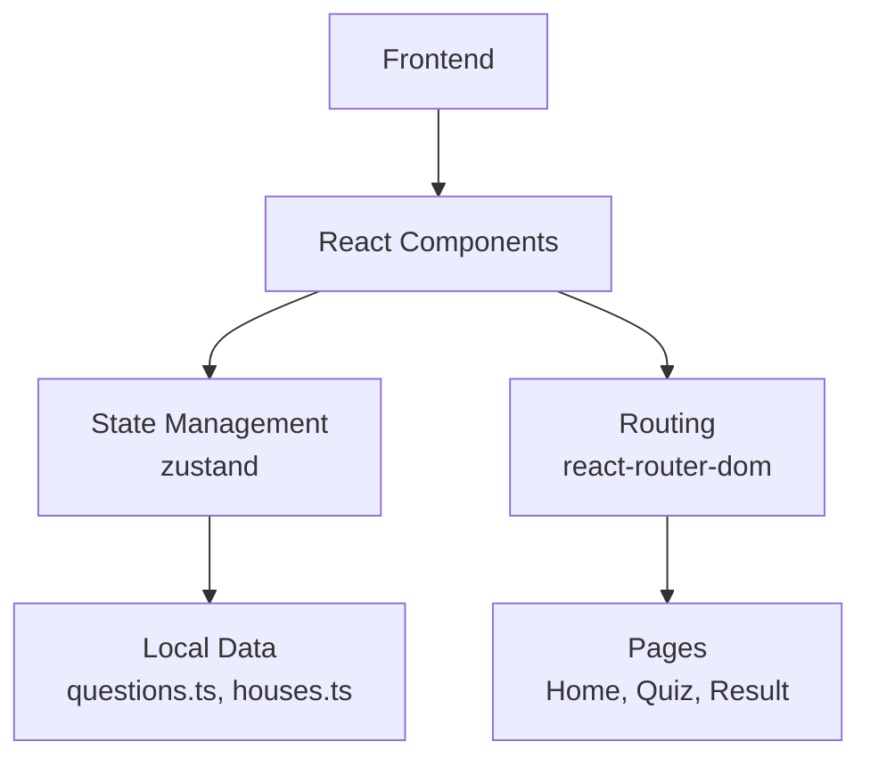

## 1. 架构设计
纯前端单页应用，无后端，所有数据本地存储和计算。



## 2. 技术描述
- **前端**：React@18 + TypeScript + tailwindcss@3 + vite
- **状态管理**：zustand
- **路由**：react-router-dom
- **初始化工具**：vite-init
- **后端**：None
- **数据库**：None

## 3. 路由定义
| 路由 | 用途 |
|-------|---------|
| / | 首页 - 欢迎界面 |
| /quiz | 测试页 - 12道测试题目 |
| /result | 结果页 - 学院分配结果 |

## 4. API 定义
无API定义（纯前端应用）

## 5. 服务器架构图
无服务器架构（纯前端应用）

## 6. 数据模型
### 6.1 数据模型定义
无数据库数据模型

### 6.2 TypeScript 类型定义
```typescript
// 学院类型
type House = 'gryffindor' | 'slytherin' | 'ravenclaw' | 'hufflepuff';

// 题目类型
interface Question {
  id: number;
  text: string;
  options: Option[];
}

// 选项类型
interface Option {
  text: string;
  scores: {
    [key in House]: number;
  };
}

// 学院信息类型
interface HouseInfo {
  name: string;
  description: string;
  characters: string[];
  colors: {
    primary: string;
    secondary: string;
  };
  emoji: string;
}

// 应用状态类型
interface AppState {
  currentQuestion: number;
  scores: { [key in House]: number };
  selectedHouse: House | null;
  reset: () => void;
  answerQuestion: (option: Option) => void;
  calculateResult: () => void;
}
```
