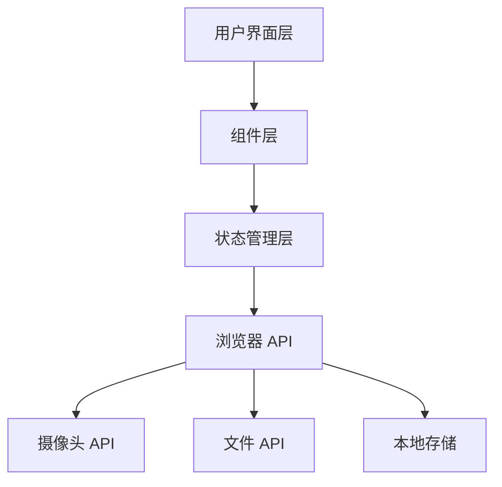
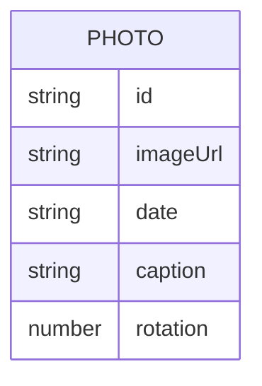

## 1. Architecture Design
拍立得应用是一个纯前端应用，无需后端服务，所有功能都在浏览器端完成。使用 React + TypeScript + Vite 进行开发，状态管理使用 Zustand。

## 2. Technology Description
- 前端: React@18 + TypeScript + tailwindcss@3 + Vite
- 初始化工具: vite-init
- 后端: None（纯前端应用）
- 状态管理: Zustand
- 图片处理: Canvas API
- 存储: LocalStorage

## 3. Route Definitions
| Route | Purpose |
|-------|---------|
| / | 主页面，包含相机界面和照片墙 |

## 4. API Definitions (if backend exists)
不适用，纯前端应用

## 5. Server Architecture Diagram (if backend exists)
不适用

## 6. Data Model
### 6.1 Data Model Definition
应用使用 LocalStorage 存储照片数据，数据结构如下：

### 6.2 Data Definition Language
不适用，使用 LocalStorage
