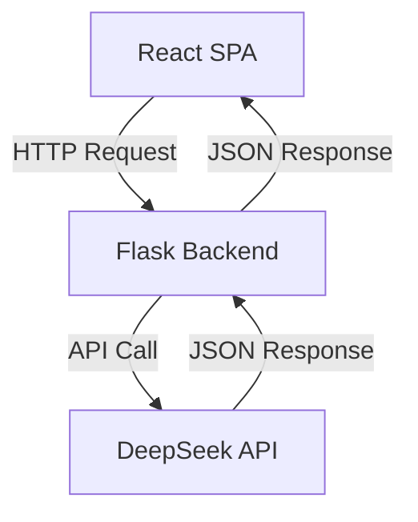

# 碳纤维复合材料出题助手 技术架构

## 1. 架构设计

前端单页应用（SPA），使用React 18 + TypeScript构建，后端通过Flask提供DeepSeek API代理服务。


```mermaid
graph TD
    A[React SPA] -->|HTTP Request| B[Flask Backend]
    B -->|API Call| C[DeepSeek API]
    C -->|JSON Response| B
    B -->|JSON Response| A
```

## 2. 技术栈

### 2.1 前端技术
- **框架**: React 18 + TypeScript
- **样式**: Tailwind CSS 3
- **构建工具**: Vite
- **路由**: React Router DOM v6
- **状态管理**: React Hooks (useState, useContext)
- **HTTP客户端**: fetch API

### 2.2 后端技术
- **框架**: Flask (Python)
- **CORS处理**: flask-cors
- **HTTP客户端**: requests
- **端口**: 5000

### 2.3 AI集成
- **API**: DeepSeek Chat API
- **模型**: deepseek-chat
- **端点**: https://api.deepseek.com

## 3. 路由定义

| 路由 | 路径 | 组件 | 描述 |
|-----|------|------|------|
| 首页 | / | Home | 欢迎页面，开始测验 |
| 测验页 | /quiz | Quiz | 答题页面 |
| 结果页 | /result | Result | 展示得分和解析 |

## 4. 数据类型

### 4.1 Question (题目)
```typescript
interface Question {
  number: number;
  question: string;
  options: {
    A: string;
    B: string;
    C: string;
    D: string;
  };
  correct_answer: string;
  explanation: string;
}
```

### 4.2 QuizState (测验状态)
```typescript
interface QuizState {
  questions: Question[];
  currentQuestion: number;
  answers: Record<number, string>;
  score: number;
  isLoading: boolean;
  error: string | null;
}
```

### 4.3 API Response (API响应)
```typescript
interface QuizAPIResponse {
  questions: Question[];
}
```

## 5. API设计

### 5.1 生成题目接口

**端点**: `POST /api/generate-quiz`

**请求体**: 无

**响应**:
```json
{
  "questions": [
    {
      "number": 1,
      "question": "题目内容",
      "options": {
        "A": "选项A",
        "B": "选项B",
        "C": "选项C",
        "D": "选项D"
      },
      "correct_answer": "A",
      "explanation": "解析内容"
    }
  ]
}
```

**错误响应**:
```json
{
  "error": "错误信息"
}
```

## 6. 项目文件结构

```
/workspace/carbon-fiber-quiz/
├── frontend/                 # React前端
│   ├── src/
│   │   ├── components/
│   │   │   ├── Home.tsx
│   │   │   ├── Quiz.tsx
│   │   │   ├── Result.tsx
│   │   │   ├── QuestionCard.tsx
│   │   │   ├── ProgressBar.tsx
│   │   │   └── ScoreDisplay.tsx
│   │   ├── services/
│   │   │   └── api.ts
│   │   ├── types/
│   │   │   └── index.ts
│   │   ├── App.tsx
│   │   ├── main.tsx
│   │   └── index.css
│   ├── package.json
│   ├── tsconfig.json
│   ├── vite.config.ts
│   └── tailwind.config.js
├── backend/                  # Flask后端
│   ├── app.py
│   └── requirements.txt
├── .env                      # 环境变量（API密钥）
└── package.json              # 根目录package.json（可选）
```

## 7. 组件说明

### 7.1 Home组件
- 功能：显示欢迎信息，开始测验按钮
- 状态：点击按钮跳转到/quiz页面

### 7.2 Quiz组件
- 功能：展示题目，接收用户答案，导航到结果页
- 状态：
  - questions: 题目列表
  - currentQuestion: 当前题目索引
  - answers: 用户答案字典
  - isLoading: 加载状态
  - error: 错误信息

### 7.3 Result组件
- 功能：展示得分，正确答案对比，详细解析
- 状态：
  - score: 得分
  - answers: 用户答案
  - questions: 题目列表
  - results: 详细结果列表

## 8. 环境变量

**后端 (.env)**:
```
DEEPSEEK_API_KEY=2a85c025526d427bb6fc55944777bc82
FLASK_PORT=5000
```

## 9. 启动流程

### 9.1 开发环境启动
1. 启动后端服务：`cd backend && python app.py`
2. 启动前端服务：`cd frontend && npm run dev`
3. 访问 http://localhost:5173

### 9.2 生产环境部署
1. 构建前端：`cd frontend && npm run build`
2. 部署后端和静态文件

## 10. 性能考虑

- DeepSeek API响应时间：3-5秒
- 前端页面加载：< 1秒
- 用户交互响应：< 100ms
- 不需要数据持久化，每次测验独立
