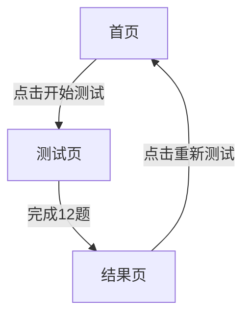

## 1. 产品概述
哈利波特分院帽测试器是一个互动式网页应用，通过12道心理测试题目将用户分配到霍格沃茨魔法学校的四个学院之一。
- 主要目的：提供娱乐性测试体验，还原哈利波特电影级视觉氛围
- 目标用户：哈利波特粉丝、喜欢趣味测试的用户

## 2. 核心功能

### 2.1 用户角色
无需登录，所有用户均可使用完整功能

### 2.2 功能模块
1. **首页**：欢迎界面、开始测试按钮
2. **测试页**：12道测试题目、进度显示
3. **结果页**：学院分配结果、百分比展示、学院介绍

### 2.3 页面详情
| 页面名称 | 模块名称 | 功能描述 |
|-----------|-------------|---------------------|
| 首页 | Hero区域 | 展示分院帽图标、欢迎文字、开始测试按钮 |
| 测试页 | 题目展示 | 逐题展示12道选择题，每题4个选项 |
| 测试页 | 进度指示 | 显示当前题目进度（如第3题/共12题） |
| 结果页 | 学院徽章 | 展示分配学院的徽章，带动画效果 |
| 结果页 | 百分比展示 | 显示四个学院的得分百分比，数字滚动动画 |
| 结果页 | 学院介绍 | 展示学院特点、代表人物、配色 |
| 结果页 | 重新测试 | 提供重新开始测试的按钮 |

## 3. 核心流程
用户进入首页 -> 点击开始测试 -> 依次回答12道题目 -> 查看学院分配结果 -> 可选择重新测试

## 4. 用户界面设计
### 4.1 设计风格
- **配色**：暗魔法氛围背景，低亮度羊皮纸纹理，学院配色（红金、绿银、蓝铜、黄黑）
- **按钮风格**：圆角矩形，悬浮发光效果，点击魔法波纹动画
- **字体**：优雅的 serif 字体（如 Georgia）搭配清晰的 sans-serif 字体
- **布局**：居中卡片式布局，适配移动端和桌面端
- **动画风格**：魔法消散/浮现、徽章缩放入场、数字滚动

### 4.2 页面设计概述
| 页面名称 | 模块名称 | UI元素 |
|-----------|-------------|-------------|
| 首页 | Hero区域 | 暗背景、星光点缀、分院帽图标、欢迎文字、发光按钮 |
| 测试页 | 题目区域 | 半透明卡片、题目文字、4个选项按钮、进度条 |
| 结果页 | 学院展示 | 缩放入场的学院徽章、滚动的百分比数字、学院介绍卡片 |

### 4.3 响应性
桌面端优先，移动端自适应，支持触摸操作

### 4.4 3D场景指南
本项目不涉及3D场景
