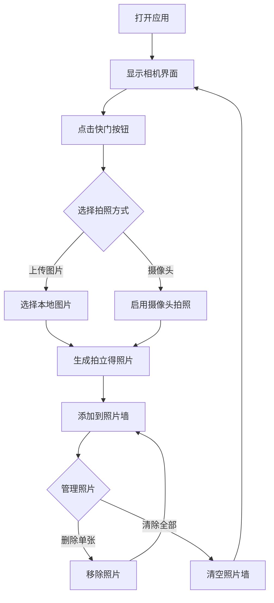

## 1. Product Overview
拍立得应用是一个模仿真实拍立得相机体验的网页应用，用户可以上传图片或使用摄像头拍照，生成具有拍立得风格的照片，并支持照片管理功能。
- 主要用途：提供类似真实拍立得相机的拍照、照片展示和管理体验
- 目标用户：喜欢复古相机风格、想要轻松创建拍立得风格照片的用户

## 2. Core Features

### 2.1 User Roles (if applicable)
无需用户登录，所有用户都可以直接使用所有功能。

### 2.2 Feature Module
1. **主页面**: 相机界面、拍照功能、照片墙展示
2. **照片管理**: 删除照片、清除所有照片功能

### 2.3 Page Details
| Page Name | Module Name | Feature description |
|-----------|-------------|---------------------|
| 主页面 | 相机界面 | 展示奶黄色复古拍立得相机UI，包含镜头、闪光灯、快门按钮等元素 |
| 主页面 | 拍照功能 | 支持上传本地图片或使用设备摄像头拍照 |
| 主页面 | 照片生成 | 生成带有白色边框和底部文字区域的拍立得风格照片 |
| 主页面 | 照片墙 | 以网格布局展示所有拍摄的照片，支持拖动散落效果 |
| 主页面 | 照片管理 | 支持单张照片删除和清除所有照片功能 |

## 3. Core Process
用户打开应用 → 看到复古拍立得相机界面 → 点击快门选择拍照方式 → 选择上传图片或使用摄像头 → 生成拍立得风格照片 → 照片展示在照片墙 → 用户可以删除单张或全部照片

## 4. User Interface Design
### 4.1 Design Style
- 主色调：奶黄色 (#F5E6C8)、浅灰色 (#F0F0F0)、白色 (#FFFFFF)
- 辅助色：深灰色 (#333333)、柔和的阴影色
- 按钮风格：复古风格，圆角，奶黄色背景，带有轻微的3D效果
- 字体：使用 Playfair Display 作为标题字体，Inter 作为正文字体，营造复古优雅的氛围
- 布局风格：左侧固定相机区域，右侧可滚动照片墙区域
- 背景：浅灰色背景，带有微妙的白色波点图案

### 4.2 Page Design Overview
| Page Name | Module Name | UI Elements |
|-----------|-------------|-------------|
| 主页面 | 相机界面 | 奶黄色复古拍立得相机，镜头有反光效果，闪光灯、快门按钮、取景框等元素，整体呈现3D C4D渲染风格 |
| 主页面 | 照片墙 | 拍立得照片以略微倾斜的角度散落排列，每张照片有白色边框和底部手写文字区域，支持鼠标悬停效果 |
| 主页面 | 操作按钮 | 删除按钮（红色系）、清除按钮（灰色系），位置在照片墙上方 |

### 4.3 Responsiveness
- Desktop-first 设计
- 在平板设备上调整为上下布局
- 在移动设备上优化按钮大小和触摸区域
- 照片墙在小屏幕上调整为单列显示

### 4.4 3D Scene Guidance (if applicable)
不适用
