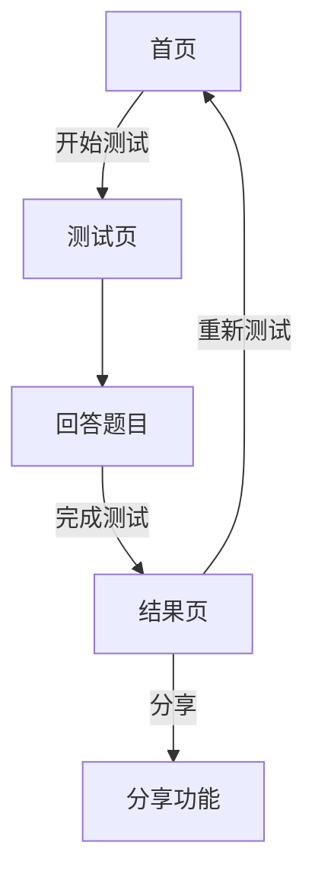

## 1. Product Overview
哈利波特分院帽测试器是一个面向中文用户的互动网页应用，帮助用户通过12道原著风格问题测试自己属于霍格沃茨的哪个学院。
- 主要功能：学院测试、结果展示、重新测试、分享功能
- 目标用户：哈利波特粉丝

## 2. Core Features

### 2.1 User Roles
不需要用户注册，所有用户均可直接使用所有功能。

### 2.2 Feature Module
1. **首页**: 霍格沃茨背景、分院帽动效、开始测试按钮、引导语
2. **测试页**: 12道单选题、上一题/下一题导航、进度条、本地缓存
3. **结果页**: 四大学院百分比、学院徽章+配色+简介、同院角色、重新测试、截图分享

### 2.3 Page Details
| Page Name | Module Name | Feature description |
|-----------|-------------|---------------------|
| 首页 | Hero Section | 霍格沃茨背景图、分院帽动画、开始测试按钮 |
| 测试页 | Question Display | 题目展示、选项按钮、上一题/下一题导航 |
| 测试页 | Progress Bar | 显示当前进度、已完成题目数 |
| 结果页 | Result Display | 学院百分比展示、学院徽章、学院简介、同院角色 |
| 结果页 | Actions | 重新测试按钮、分享功能 |

## 3. Core Process
用户访问首页 → 点击开始测试 → 依次回答12道题目 → 查看结果 → 重新测试或分享

## 4. User Interface Design
### 4.1 Design Style
- Primary Colors: 深紫/墨黑/金/银，魔法暗黑氛围
- Button Style: 圆角按钮，金色边框，渐变色背景
- Fonts: 复古衬线字体
- Layout Style: 卡片式布局，响应式设计
- Animation: 微光动效、悬浮反馈
- Visual: 羊皮纸纹理、霍格沃茨风格

### 4.2 Page Design Overview
| Page Name | Module Name | UI Elements |
|-----------|-------------|-------------|
| 首页 | Hero Section | 霍格沃茨背景，中心分院帽动画，金色按钮 |
| 测试页 | Question Display | 居中卡片，羊皮纸纹理，选项按钮 |
| 结果页 | Result Display | 学院徽章，百分比条形图，学院配色 |

### 4.3 Responsiveness
移动端优先，响应式设计，无横向滚动
