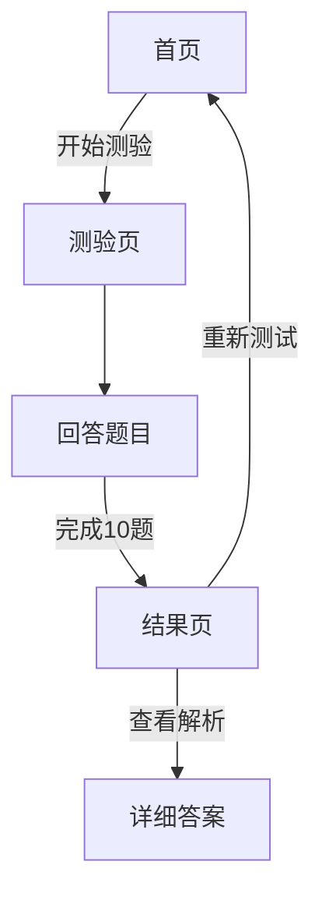

# 碳纤维复合材料出题助手 PRD

## 1. 产品概述

复合材料碳纤维出题助手是一个面向材料科学领域学习者的在线测验网页应用，帮助用户通过10道选择题测试和提升碳纤维复合材料相关知识。

- **主要功能**：智能出题、在线答题、自动评分、详细解析
- **目标用户**：材料科学专业学生、碳纤维行业从业者、复合材料研究人员
- **核心价值**：利用AI技术自动生成高质量测验题目，降低出题成本，提升学习效率

## 2. 核心功能

### 2.1 用户角色
不需要用户注册，所有用户均可直接使用所有功能。

### 2.2 功能模块
1. **首页**: 欢迎界面、主题介绍、开始测验按钮
2. **测验页**: 10道选择题、选项高亮、提交答案、进度显示
3. **结果页**: 得分展示、正确答案对比、详细解析、重新测试

### 2.3 页面详情
| 页面名称 | 模块名称 | 功能描述 |
|---------|---------|---------|
| 首页 | Hero区域 | 碳纤维主题背景、开始测验按钮 |
| 测验页 | 题目展示 | 单选题展示、选项按钮、提交按钮 |
| 测验页 | 进度条 | 显示当前进度（1/10 - 10/10） |
| 结果页 | 得分展示 | 百分制得分、正确率统计 |
| 结果页 | 答案对比 | 用户答案与正确答案对比 |
| 结果页 | 详细解析 | 每道题的正确答案和解析 |
| 结果页 | 操作区 | 重新测试按钮 |

## 3. 核心流程

用户访问首页 → 点击开始测验 → 依次回答10道题目 → 查看结果 → 查看详细解析 → 重新测试

```mermaid
flowchart TD
    A[首页] -->|开始测验| B[测验页]
    B --> C[回答题目]
    C -->|完成10题| D[结果页]
    D -->|查看解析| E[详细答案]
    D -->|重新测试| A
```

## 4. 用户界面设计

### 4.1 设计风格
- **主色调**: 深灰/黑色 + 碳纤维纹理 + 科技蓝点缀（#3B82F6）
- **按钮风格**: 圆角按钮，悬停效果，微光动效
- **字体选择**: 现代无衬线字体（如Outfit或Plus Jakarta Sans）
- **布局风格**: 卡片式布局，响应式设计
- **动画效果**: 淡入淡出、悬浮反馈、答案提交动效
- **视觉效果**: 碳纤维编织纹理、科技感线条、渐变背景

### 4.2 页面设计概览
| 页面名称 | 模块名称 | UI元素 |
|---------|---------|--------|
| 首页 | Hero区域 | 深色背景，碳纤维纹理，中心标题和开始按钮 |
| 测验页 | 题目卡片 | 居中卡片，白色/深色主题，选项按钮网格 |
| 测验页 | 进度条 | 顶部进度指示器 |
| 结果页 | 得分展示 | 大字体分数，圆形进度图 |
| 结果页 | 答案对比 | 列表式展示，绿色/红色标记 |
| 结果页 | 详细解析 | 折叠式解析区域 |

### 4.3 响应式设计
- 桌面端：居中卡片布局，最大宽度800px
- 平板端：自适应宽度，保持边距
- 移动端：全宽布局，按钮堆叠排列
- 无横向滚动，内容自适应缩放

## 5. 数据说明

### 5.1 题库来源
- 通过DeepSeek API动态生成
- 每次生成10道新题目
- 涵盖碳纤维复合材料的多个知识领域

### 5.2 知识领域覆盖
- 材料特性与结构（2-3题）
- 制备工艺与生产（2-3题）
- 应用领域（2-3题）
- 性能测试与表征（1-2题）
- 工程设计与计算（1-2题）

### 5.3 题目格式
每道题包含：
- 题目内容（问题描述）
- 4个选项（A、B、C、D）
- 正确答案
- 详细解析

## 6. 技术约束

- **浏览器支持**: Chrome、Firefox、Safari、Edge最新版本
- **网络要求**: 需要互联网连接（调用DeepSeek API）
- **加载时间**: 题目生成预计3-5秒
- **数据持久化**: 不需要本地存储，每次测验独立进行
